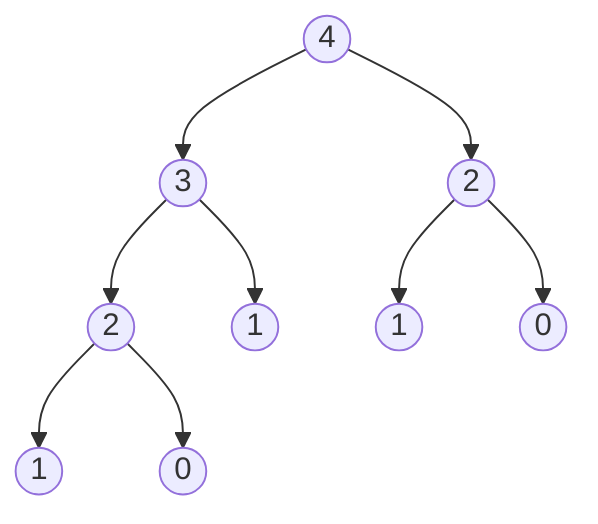
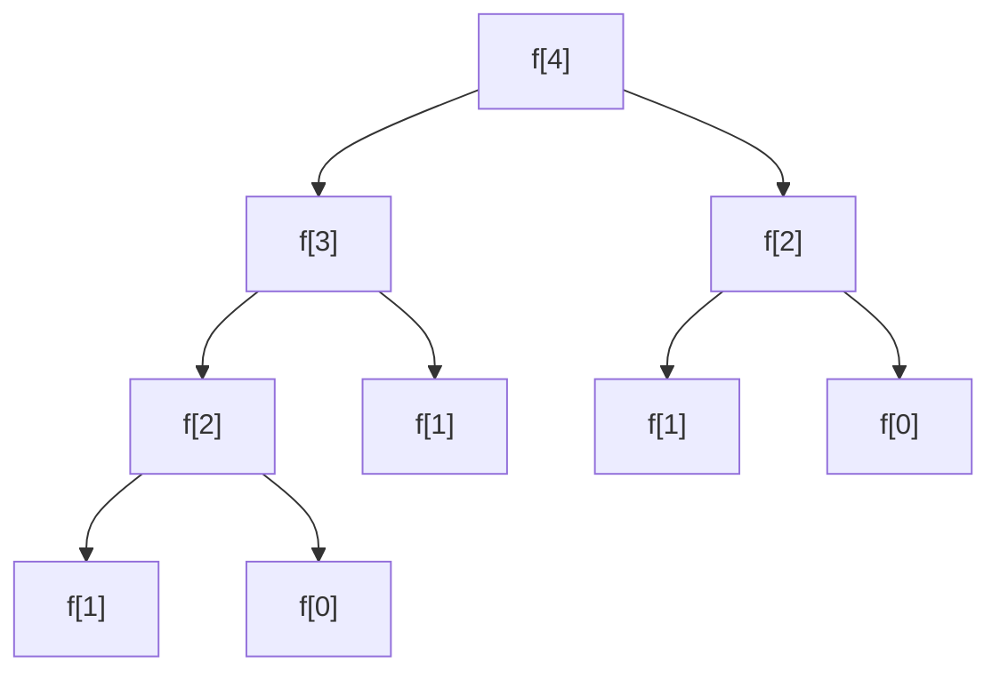

# Fibonacci
## Problem :
>Given a dynamic programming algorithm to compute the nth Fibonacci number.
## Recursive Formula :
- `n` is nth number of the fibonacci sequence.
- Fibonacci sequence start like 0,1,1,2,3,5,8,13,21,...

### Formula :

`f[n]= f[n-1] + f[n-2]`

## Top-Down :
```java
public class TopDown {
    public static int memoizedFibonacci(int n){
        int[] r = new int[n+1];
        for (int i = 0; i <=n; i++){
            r[i] = 0;
        }
        return memoizedFibonacciAux(n, r);
    }

    public static int memoizedFibonacciAux(int n, int[] r){
        if (n == 0 || n == 1){
            return n;
        }
        int q;
        if (r[n] > 0){
            return r[n];
        }else {
            q = memoizedFibonacciAux(n - 1, r) + memoizedFibonacciAux(n - 2, r);
            r[n] = q;
        }
        return q;
    }
}
```
> You need a find maximum method to above code works well. For complete code, details and other forms [click](src/dynamicProgarmming/fibonacci/TopDownFibonacci.java).


## Bottom-Up :
```java
public class BottomUp {
    public static int bottomUpFibonacci(int n){
        int[] r = new int[n+1];
        r[0] = 0;
        r[1] = 1;
        int q = -1;
        for (int i = 2; i <= n; i++) {
            q = r[i-1] + r[i-2];
            r[i] = q;
        }
        return q;
    }
}
```
> You need a find maximum method to above code works well. For complete code, details and other forms [click](src/dynamicProgarmming/fibonacci/BottomUpFibonacci.java).

### Example:
 #### Given Fibonacci Number Table
| index `i`  | 0 | 1 | 2 | 3 | 4 | 5 | 6 | 7  | 8  | 9  | 10 | ... |
|------------|---|---|---|---|---|---|---|----|----|----|----|-----|
| number `i` | 0 | 1 | 1 | 2 | 3 | 5 | 8 | 13 | 21 | 34 | 55 | ... |
<!--
- If we have a rod of length, 5 and want to cut up the rod and selling with maximum revenue or cost, we can obtain the cost with recursive formula:

rod with length of 5:

- `r[5]= max(p[i] + r[5-i])` & `1 <= i <= 5`

    - [ ] `i = 1` ==> p[1] + r[4] = 11
    - [x] `i = 2` ==> p[2] + r[3] = 13
    - [x] `i = 3` ==> p[3] + r[2] = 13
    - [ ] `i = 4` ==> p[4] + r[1] = 10
    - [ ] `i = 5` ==> p[5] + r[0] = 10


- `r[4]= max(p[i] + r[4-i])` & `1 <= i <= 4`

    - [ ] `i = 1` ==> p[1] + r[3] = 9
    - [x] `i = 2` ==> p[2] + r[2] = 10
    - [ ] `i = 3` ==> p[3] + r[1] = 9
    - [ ] `i = 4` ==> p[4] + r[0] = 9


- `r[3]= max(p[i] + r[3-i])` & `1 <= i <= 3`

    - [ ] `i = 1` ==> p[1] + r[2] = 6
    - [ ] `i = 2` ==> p[2] + r[1] = 6
    - [x] `i = 3` ==> p[3] + r[0] = 8


- `r[2]= max(p[i] + r[2-i])` & `1 <= i <= 2`

    - [ ] `i = 1` ==> p[1] + r[1] = 2
    - [x] `i = 2` ==> p[2] + r[0] = 5


- `r[1]= max(p[i] + r[1-i])` & `1 <= i <= 1`

    - [x] `i = 1` ==> p[1] + r[0] = 1


- `r[0] = 0` ==> base condition
-->
---
## Recursion Tree

- Recursion tree of 4th fibonacci number.
<!-- 
- parent label `s`
- child label `t`
- an edge from parent to child corresponds to cutting of an initial piece of size `s-t` and remainder of size `t`.
- -->

## Recursion Tree of Formula



## Bottom-Up Tabulation
<!--
- Each home that has non-negative value shows values of revenue.
- In each column the biggest value is maximum revenue that obtains from rod of length `j`.
- `-` this notion for infinity value or initialize value of arrays or shows that haven't valuable value.


| `i\j` | 0 | 1 | 2 | 3 |  4   |
|:-----:|---|---|---|---|:----:|
|   0   | 0 | - | - | - |  -   |
|   1   | - | 1 | 2 | 6 |  9   |
|   2   | - | - | 5 | 6 |  10  |
|   3   | - | - | - | 8 |  9   |
|   4   | - | - | - | - |  9   |
-->