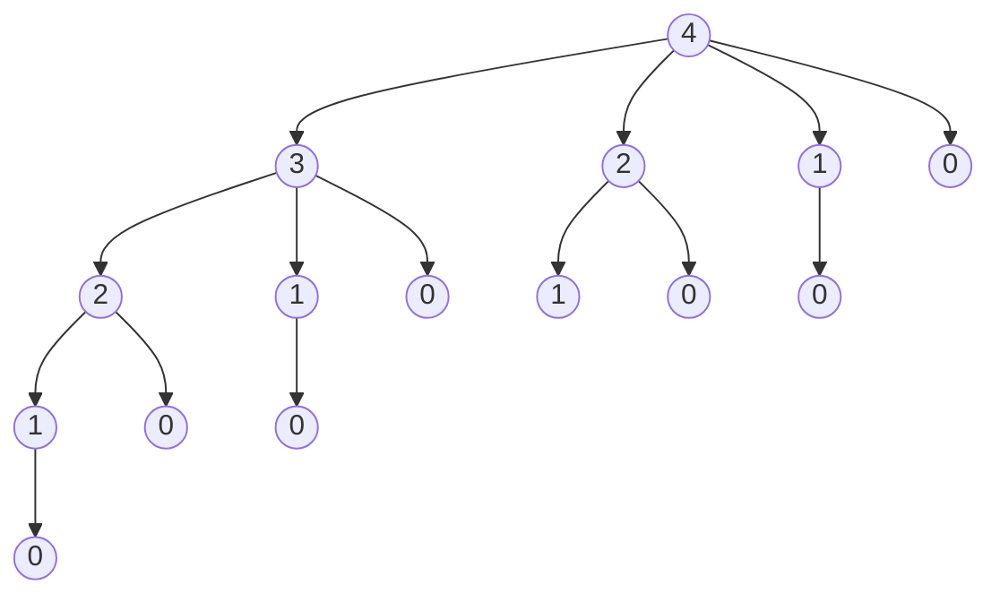
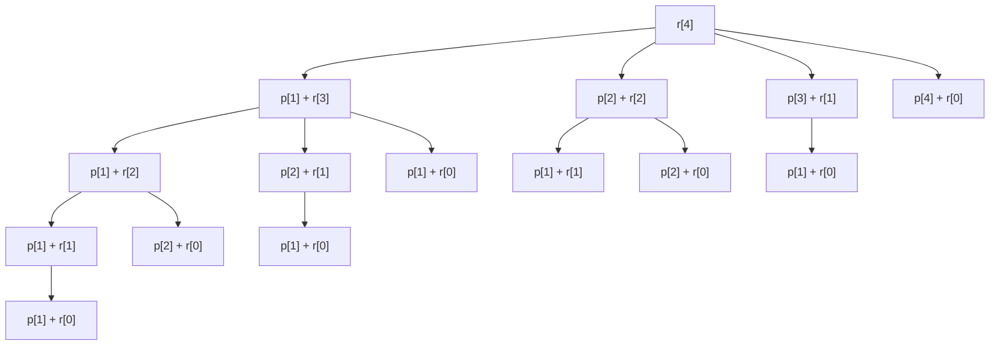

# Rod Cutting

## Recursive Formula:
- `n` is length of rod
- `i` is an index that shows feasible location for cutting
- `p[]` is an array that shows price of rod without cutting
- `r[]` is an array that store maximum revenue obtains by cutting up the rod of length n

### Formula :

`r[n]= max(p[i] + r[n-i])` & `1 <= i <= n`

### Example:

#### Table of Price
| length `i` | 0 | 1 | 2 | 3 | 4 | 5  | 6  | 7  | 8  | 9  | 10 |
|------------|---|---|---|---|---|----|----|----|----|----|----|
| price `i`  | 0 | 1 | 5 | 8 | 9 | 10 | 17 | 17 | 20 | 24 | 30 |
  
- If we have a rod of length, 4 and want to cut up the rod and selling with maximum revenue or cost, we can obtain the cost with recursive formula:

rod with length of 5:

- `r[5]= max(p[i] + r[5-i])` & `1 <= i <= 5`

    - [ ] `i = 1` ==> p[1] + r[4] = 11
    - [x] `i = 2` ==> p[2] + r[3] = 13
    - [x] `i = 3` ==> p[3] + r[2] = 13
    - [ ] `i = 4` ==> p[4] + r[1] = 10
    - [ ] `i = 5` ==> p[5] + r[0] = 10

- `r[4]= max(p[i] + r[4-i])` & `1 <= i <= 4`

  - [ ] `i = 1` ==> p[1] + r[3] = 9
  - [x] `i = 2` ==> p[2] + r[2] = 10
  - [ ] `i = 3` ==> p[3] + r[1] = 9
  - [ ] `i = 4` ==> p[4] + r[0] = 9

- `r[3]= max(p[i] + r[3-i])` & `1 <= i <= 3`

  - [ ] `i = 1` ==> p[1] + r[2] = 6
  - [ ] `i = 2` ==> p[2] + r[1] = 6
  - [x] `i = 3` ==> p[3] + r[0] = 8

- `r[2]= max(p[i] + r[2-i])` & `1 <= i <= 2`

  - [ ] `i = 1` ==> p[1] + r[1] = 2 
  - [x] `i = 2` ==> p[2] + r[0] = 5

- `r[1]= max(p[i] + r[1-i])` & `1 <= i <= 1`

  - [x] `i = 1` ==> p[1] + r[0] = 1

- `r[0] = 0` ==> base condition

---
## Recursion Tree

- Recursion tree of rod with length of 4.
- parent label `s`
- child label `t`
- an edge from parent to child corresponds to cutting of an initial piece of size `s-t` and remainder of size `t`.

## Recursion Tree of Formula

